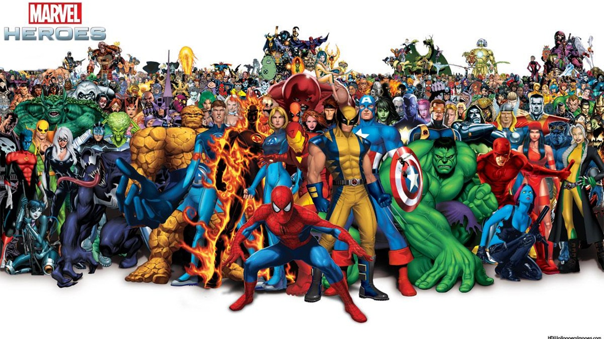

# MarvelBattle

MarvelBattle interacts with a user via terminal so that the user can play a game called MarvelBattle. User must choose three marvel characters among the provided list then the computer will choose ramdom three characters to fight against with. <br />
This program uses Marvel API(https://developer.marvel.com/) to get marvel characters data.  

## Install
### Clone the repository
```
git clone git@github.com:Cicada0315/MarvelBattle.git
cd MarvelBattle
```
### Install gem
```
bundle install
```
### Get a key and add key to the api.rb
```
Use below link and Sign-up and get a key. 
link: https://www.marvel.com/signin?referer=https%3A%2F%2Fdeveloper.marvel.com%2F

In lib/api.rb add value of two class constant.
class API
PUBLICKEY=""
PRIVATEKEY=""
```
### Run
```
ruby bin/run
``` 

## Guide for user
This program interact with user only with numbers. User can choose among certain range of number with description in it.
### Main Option:
```
Enter 1: Select_characters 
Enter 2: Character_information 
Enter 3: To end the program 
```
### Character_information option (from main option 2):
```
Enter 1: Image of character 
Enter 2: Abilities 
Enter 3: Comics 
Enter 4: Series 
Enter 5: Description 
```

### Select_characters (from main option 1):
```
Select three unique characters that will fight for you.
Once you have correct selection, computer will choose random opponants.
Now, you are ready to play!
```

### Play:
Each of the marvel character has six abilities with rating. </br>
[durability, energy, fighting_skills, intelligence, speed, strength]</br>
Each match, program will compute each character's ability and tells you which character won for that match. When you enter 4 will tells you who won the battle. 
```
Enter 1: Match1
Enter 2: Match2
Enter 3: Match3
Enter 4: Winner of this battle
Enter 5: Go back to option
Enter 6: To end the program
```

## Welcome to MarvelBattle and enjoy the game!
I will improve this program later by giving each of the abilities with percentage so user and computer can atually fight each other. Giving user option to select ability to attack the opponant something like that. </br>

## MIT License
https://github.com/Cicada8282/MarvelBattle/blob/main/LICENSE

## ACM / IEEE  Software Engineering  Code of Ethics and Professional Practice

https://www.cengage.com/resource_uploads/downloads/0176764674_599139.pdf
